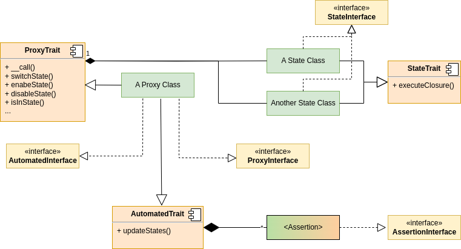
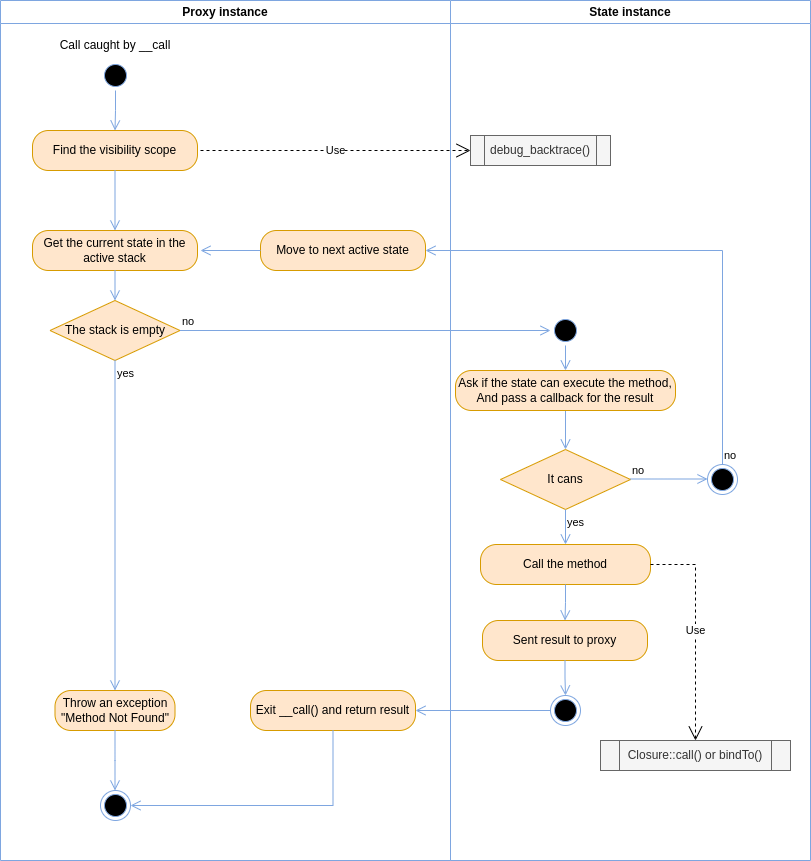

Teknoo Software - States library
================================

Introduction
------------
States allows you to create PHP classes following the [State Pattern](http://en.wikipedia.org/wiki/State_pattern) in
PHP. This can be a cleaner way for an object to change its behavior at runtime without resorting to large monolithic 
conditional statements and this improve maintainability and workflows writing.

Main features of States are :
* **Create Several States** : Split classes in states to avoid un-understandable large monolithic statements.
* **Inherit States and Classes** : Complete and factorize states thanks to inheritance.
    * Stated classes can be also inherited.
* **Automate States Switching** : Define states switching rules based on object's properties.
* **Implement Every Where**: Thanks to traits and interfaces, use this pattern on your existing code.
    * Compatible with Doctrine.

Architecture
------------
This library is built on two specifics features introducing in PHP 7 :

*   `Closure::call()` or `Closure::rebindTo()` To rebind the closure to reference $this to the object instance.
*   The new operator `...` to unpack quickly argument passed by `__call()`

Used together, these two methods allow developers to add dynamically methods on objects, rebind the variable `$this`
to these objects and static to theirs class names.

This library reuses this behavior to implement states. A stated class is an extended PHP class, composed of several
standard PHP classes :

*   One standard PHP class by state, implementing the `StateInterface` via the `StateTrait`, 
    managing methods available for each state.
*   A main standard PHP class, called proxy, implementing the `ProxyInterface` via the `ProxyTrait`,
    extended to represent stated class instances (from stated classes). `$this` referencing these proxy.
  *   With the `ProxyTrait` implementation, each state class must be declared into the proxy class,
      via the protected static method `statesListDeclaration()`.

During proxy instantiating, the proxy finds and loads all states declared.

Workflow
--------

How-to
------
* To create [a stated class and use it](howto/write-stated-class.md).
* To [automate your stated class](howto/automation.md).
* To configure [PHPStan to support your stated class](howto/phpstan.md)

Full Example
------------
An example of using this library is available in the folder : [Demo](../demo/demo_article.php).

Credits
-------
EIRL Richard Déloge - <https://deloge.io> - Lead developer.
SASU Teknoo Software - <https://teknoo.software>

About Teknoo Software
---------------------
**Teknoo Software** is a PHP software editor, founded by Richard Déloge, as part of EIRL Richard Déloge.
Teknoo Software's goals : Provide to our partners and to the community a set of high quality services or software,
sharing knowledge and skills.

License
-------
State is licensed under the MIT License - see the licenses folder for details.
