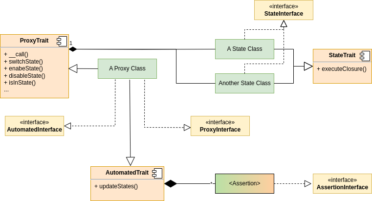
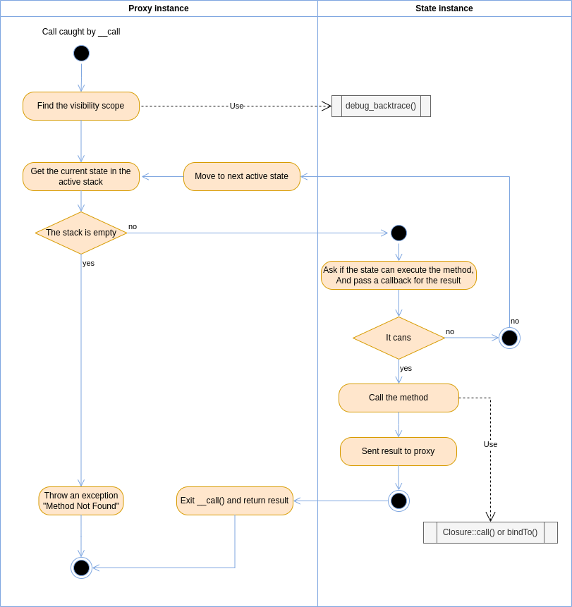

Teknoo Software - States library
================================

Introduction
------------
States allows you to create PHP classes following the [State Pattern](https://en.wikipedia.org/wiki/State_pattern) in
PHP. This can be a cleaner way for an object to change its behavior at runtime without resorting to large monolithic
conditional statements, and this improves maintainability and workflow writing.

Main features of States are :

* **Create Several States** : Split classes in states to avoid unmaintainable large monolithic statements.
* **Inherit States and Classes** : Complete and factorize states thanks to inheritance.
    * Stated classes can be also inherited.
* **Automate States Switching** : Define states switching rules based on object's properties.
* **Implement Everywhere**: Thanks to traits and interfaces, use this pattern on your existing code.
    * Compatible with Doctrine.

Architecture
------------
This library is built on two features of PHP :

* `Closure::call()` or `Closure::bindTo()` to rebind a closure : `$this` references the object instance, `self` and
  `static` reference its class.
* The operator `...` to quickly unpack arguments passed by `__call()`.

Used together, these two features allow developers to dynamically add methods on objects. PHP forbids to bind a closure
created from a method to an object of another class : this is why methods of states are builders, returning the closure
to execute. It is explained in [how to write methods of states](howto/state-methods.md).

This library reuses this behavior to implement states. A stated class is an extended PHP class, composed of several
standard PHP classes :

* One standard PHP class by state, implementing the `StateInterface` via the `StateTrait`,
  managing methods available for each state.
* A main standard PHP class, called proxy, implementing the `ProxyInterface` via the `ProxyTrait`,
  extended to represent stated class instances (from stated classes). `$this` always references this proxy.
    * With the `ProxyTrait` implementation, each state class must be declared into the proxy class,
        * via the attribute `#[Teknoo\States\Attributes\StateClass()]`,
        * via the protected static method `statesListDeclaration()` **(deprecated)**.

During the proxy instantiation, the proxy finds and loads all declared states.

Workflow
--------

How-to
------

* To create [a stated class and use it](howto/write-stated-class.md).
* To write [methods of states](howto/state-methods.md), and why they are builders of closures.
* To [automate your stated class](howto/automation.md).
* To use stated classes with [Doctrine](howto/doctrine.md).
* To configure [PHPStan to support your stated class](howto/phpstan.md).

Full Example
------------
An example of using this library is available in the folder : [Demo](../demo/demo_article.php).

Credits
-------
EIRL Richard Déloge - <https://deloge.io> - Lead developer.
SASU Teknoo Software - <https://teknoo.software>

About Teknoo Software
---------------------
**Teknoo Software** is a PHP software editor, founded by Richard Déloge, as part of EIRL Richard Déloge.
Teknoo Software's goals : Provide to our partners and to the community a set of high quality services or software,
sharing knowledge and skills.

License
-------
States is licensed under the 3-Clause BSD License - see the [LICENSE](../LICENSE) file for details.
